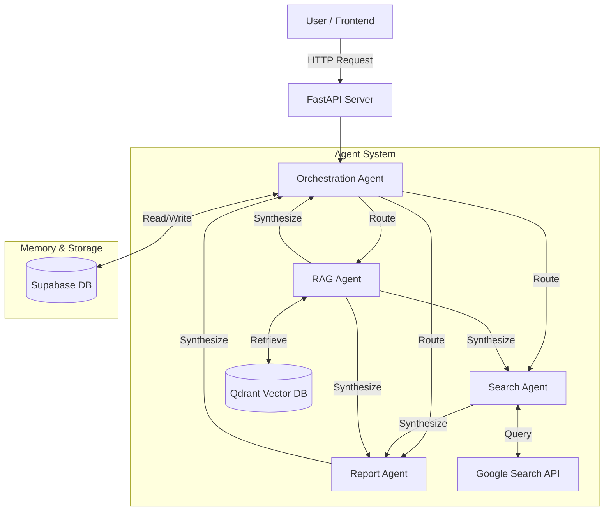

# MedChat API: Multi-Agent Medical AI Backend

A sophisticated multi-agent AI system designed to assist medical students with comprehensive medical information, current research, and clinical guidance. MedChat leverages **Google Gemini 2.0**, **LangChain**, **Qdrant**, **Supabase**, and **FastAPI** to provide intelligent, context-aware responses.

This repository hosts the **API Backend**. It is designed to be deployed via Docker and consumed by any frontend application (Web, Mobile, etc.).

## 🏗️ Architecture

The system consists of a multi-agent backend exposed via a REST API, with persistent memory and vector search capabilities.



## 🚀 Getting Started (Docker)

The recommended way to run MedChat is using Docker. This ensures all dependencies are correctly installed and isolated.

### Prerequisites
- [Docker Desktop](https://www.docker.com/products/docker-desktop/) installed and running.
- A `.env` file with your API keys (see Configuration below).

### 1. Build the Image
```bash
docker build -t medchat-api .
```

### 2. Run the Container
Run the container, passing your environment variables. We use Google DNS (`8.8.8.8`) to ensure external services like Qdrant are resolvable.

```bash
docker run -d -p 8000:8000 --env-file .env --dns 8.8.8.8 --name medchat-container medchat-api
```

The API will be available at **[http://localhost:8000](http://localhost:8000)**.

- **Interactive Docs (Swagger UI)**: [http://localhost:8000/docs](http://localhost:8000/docs)
- **Health Check**: [http://localhost:8000/health](http://localhost:8000/health)

---

## 🛠️ Local Development (Python)

If you prefer running locally without Docker:

1.  **Clone and Setup**:
    ```bash
    python -m venv venv
    # Windows
    venv\Scripts\activate
    # Linux/Mac
    source venv/bin/activate
    
    pip install -r requirements.txt
    ```

2.  **Run Server**:
    ```bash
    uvicorn api:app --reload
    ```

---

## 🔌 API Documentation

### 1. Chat Endpoint
**POST** `/chat`

Process a user query through the multi-agent system.

**Request Body:**
```json
{
  "query": "What are the symptoms of diabetes?",
  "session_id": "optional-uuid-string"
}
```

**Response:**
```json
{
  "answer": "The symptoms of diabetes include...",
  "session_id": "uuid-string",
  "agent_type": "rag",
  "retrieved_documents": [
    {
      "content": "Diabetes mellitus is a chronic disease...",
      "metadata": {"source": "Harrison's Principles", "page": 42},
      "score": 0.85
    }
  ],
  "search_results": [],
  "thinking_time": 1.25
}
```

### 2. Health Check
**GET** `/health`

Check the status of all system components (Qdrant, Supabase, Agents).

**Response:**
```json
{
  "status": "healthy",
  "components": {
    "qdrant": true,
    "orchestration_agent": true,
    "rag_agent": true,
    "search_agent": true,
    "report_agent": true,
    "supabase_memory": true
  }
}
```

### 3. Clear History
**DELETE** `/history/{session_id}`

Clear the conversation memory for a specific session.

---

## 🔑 Configuration

Create a `.env` file in the root directory:

```ini
# Google Gemini API
GOOGLE_API_KEY="your_google_api_key"

# Qdrant Vector DB
SERVICE_URL_QDRANT="your_qdrant_url"
SERVICE_PASSWORD_QDRANTAPIKEY="your_qdrant_api_key"

# Supabase (Memory)
SUPABASE_URL="your_supabase_url"
SUPABASE_SERVICE_ROLE_KEY="your_supabase_service_role_key"

# App Config
LOG_LEVEL="INFO"
```

## 🤖 Agent Capabilities

-   **Orchestration Agent**: Analyzes queries, manages conversation history (via Supabase), and routes tasks to specialized agents.
-   **RAG Agent**: Retrieves medical knowledge from the Qdrant vector database (Medical Textbooks).
-   **Search Agent**: Fetches real-time information using Google Search (News, Recent Studies).
-   **Report Agent**: Synthesizes information from multiple sources into comprehensive reports when requested.
